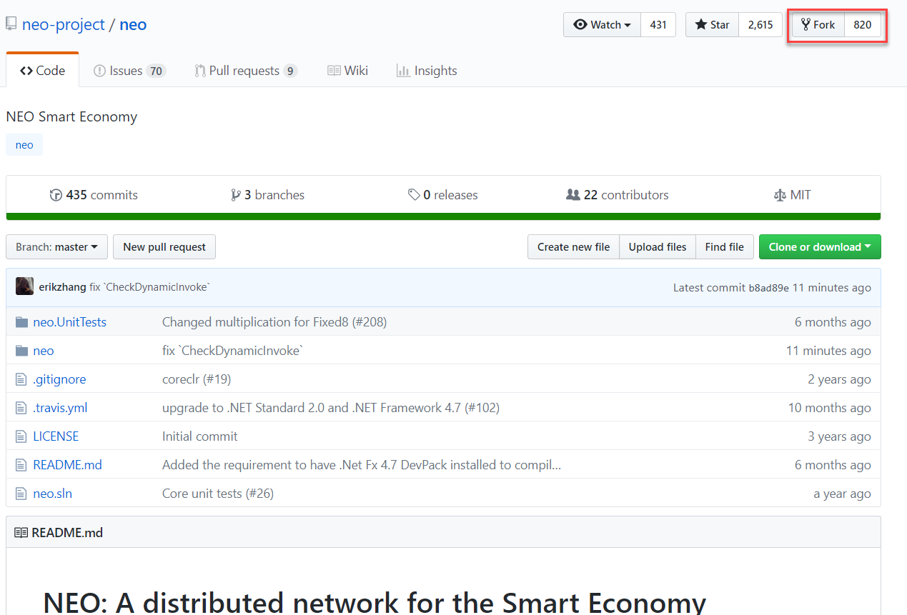
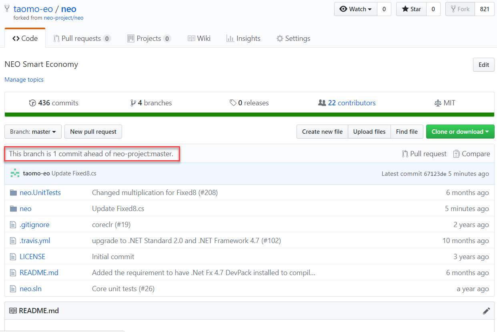
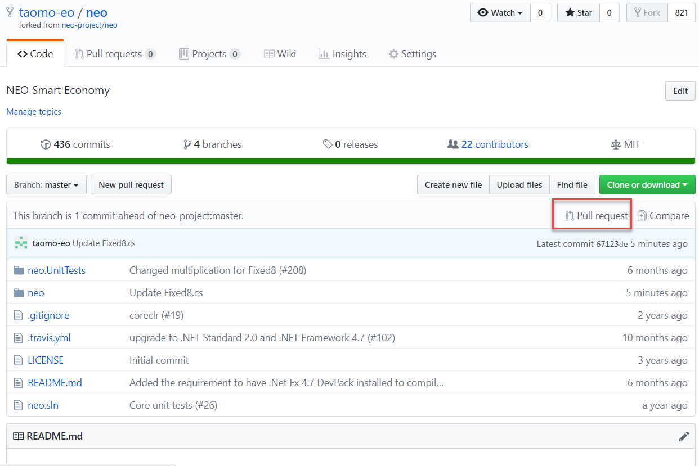

## 如何成为核心开发者

NEO是一个开源项目。我们欢迎开发者向我们的[核心项目](#核心项目)贡献代码。并会对贡献大的开发者给予相应的报酬。

如果要向NEO的项目作出贡献(需要有GitHub账号): 

- 进入一个NEO核心项目的GitHub页面(比如: https://github.com/neo-project/neo)

- 分叉(Fork)这个项目

  

- 在你的分叉上进行对项目的测试和更新

- 更新完成后，可以看到自己的分叉和原来项目的区别对比

  

- 提交Pull Request。

  

- 如果你的Pull Request被接受，其中的改动会被合并(Merge)到主项目里。

- ***如果一个开发者对NEO核心项目有足够多的Pull Request被接受，就会被给予核心开发者的称号。***

***NEO的核心开发者将会***

- 获得项目的'collaborator'权限。可以直接修改项目，以及管理其他的Pull Request。(?)

- ***得到来自NEO Foundation发放的工资。***工资将由开发者的贡献量决定。此后对NEO核心项目有持续贡献的可以长期算作核心开发者。

### 核心项目

*以下项目被视为NEO的核心项目。对这些项目贡献足够代码的开发者可以成为核心开发者*

- [/neo-project/neo](https://github.com/neo-project/neo)

